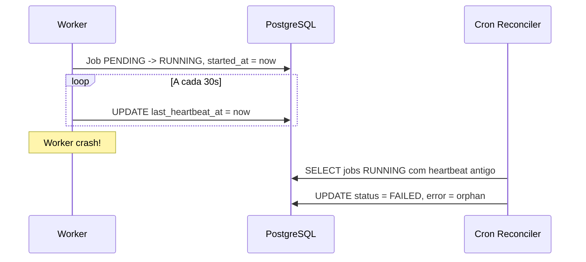

# Detecção de Jobs Órfãos via Heartbeat

## Contexto

Atualmente, o sistema possui:
- Cron `reconcile_pending_orphans` que trata apenas jobs **PENDING** com `started_at IS NULL`
- Não há detecção de jobs **RUNNING** que ficaram órfãos (worker morreu durante execução)

## Arquitetura Proposta



## Mudanças Necessárias

### 1. Modelo Job - Novo Campo

Arquivo: [backend/app/model/job.py](backend/app/model/job.py)

- Adicionar campo `last_heartbeat_at: Optional[datetime]`
- Tipo: `timestamptz` (padrão do projeto)
- Nullable: Sim (jobs antigos não terão)

### 2. Migration Alembic

Arquivo: `backend/alembic/versions/XXXX_add_last_heartbeat_at_to_job.py`

- Adicionar coluna `last_heartbeat_at` (timestamptz, nullable)
- Criar índice parcial: `ix_job_running_heartbeat` em `(status, last_heartbeat_at)` WHERE status = 'RUNNING'

### 3. Worker - Heartbeat em Thread Separada

Arquivo: [backend/app/worker/job.py](backend/app/worker/job.py)

- Criar função `_heartbeat_loop(session, job_id, stop_event)` que atualiza `last_heartbeat_at` a cada 30s
- Executar em thread separada (não bloqueia processamento)
- Parar thread ao finalizar job (COMPLETED/FAILED)

Funções a modificar:
- `generate_schedule_job` - job mais demorado, crítico
- `extract_demand_job` - pode demorar com arquivos grandes
- `generate_thumbnail_job` - rápido, opcional

### 4. Cron Reconciler - Expandir para RUNNING

Arquivo: [backend/app/worker/job.py](backend/app/worker/job.py) (função `reconcile_pending_orphans`)

Renomear para `reconcile_orphan_jobs` e adicionar lógica:

```python
# Detectar jobs RUNNING com heartbeat ausente ou antigo (> 2 min)
orphan_threshold = timedelta(minutes=2)
running_orphans = session.exec(
    select(Job).where(
        Job.status == JobStatus.RUNNING,
        or_(
            Job.last_heartbeat_at.is_(None),  # Worker antigo sem heartbeat
            Job.last_heartbeat_at < (now - orphan_threshold)
        ),
        Job.started_at < (now - orphan_threshold)  # Segurança: não pegar jobs recém-iniciados
    )
).all()

for job in running_orphans:
    job.status = JobStatus.FAILED
    job.error_message = "orphan: job RUNNING sem heartbeat; worker provavelmente morreu"
    job.completed_at = now
```

### 5. Documentação

Arquivos a atualizar:
- [CHECKLIST.md](CHECKLIST.md) - Adicionar seção sobre jobs órfãos
- [STACK.md](STACK.md) - Documentar heartbeat no worker
- [DIRECTIVES.md](DIRECTIVES.md) - Regras de tratamento de jobs órfãos

## Configurações

| Parâmetro | Valor | Descrição |
|-----------|-------|-----------|
| Intervalo heartbeat | 30s | Worker atualiza `last_heartbeat_at` |
| Threshold órfão | 2 min | Tempo sem heartbeat para considerar órfão |
| Cron reconciler | 5 em 5 min | Já existente, será expandido |

## Considerações

- **Backward compatibility**: Jobs antigos (sem `last_heartbeat_at`) também serão detectados como órfãos se RUNNING por muito tempo
- **Thread safety**: Heartbeat em thread separada para não bloquear processamento
- **Performance**: Índice parcial otimiza query do reconciler
- **Não usar novo status**: Manter `FAILED` com mensagem específica (evita migration de enum)
